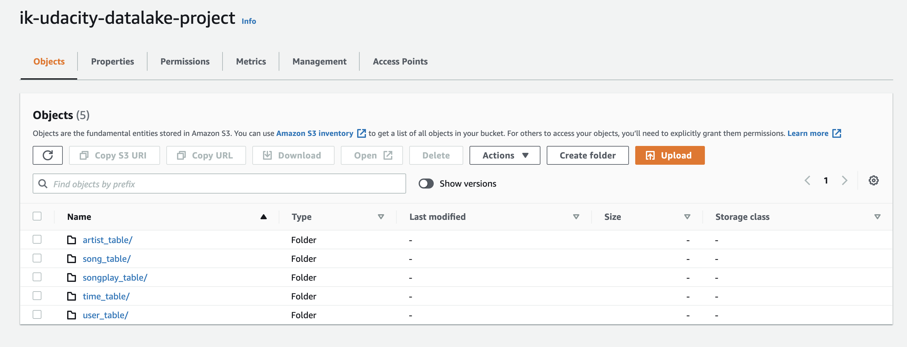
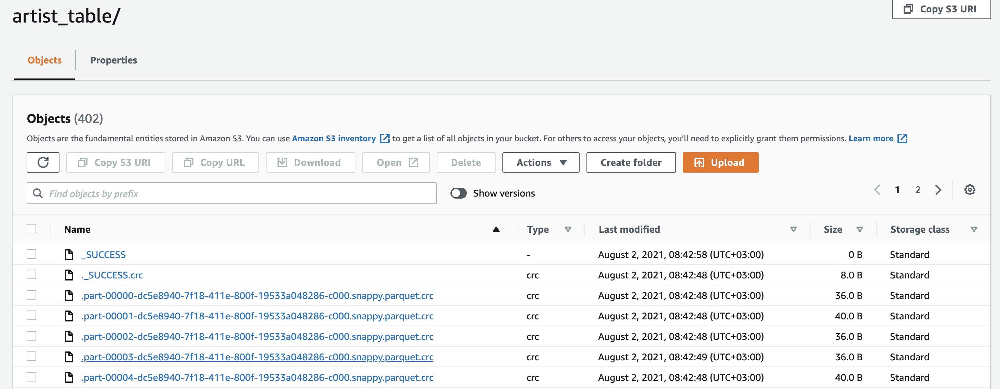
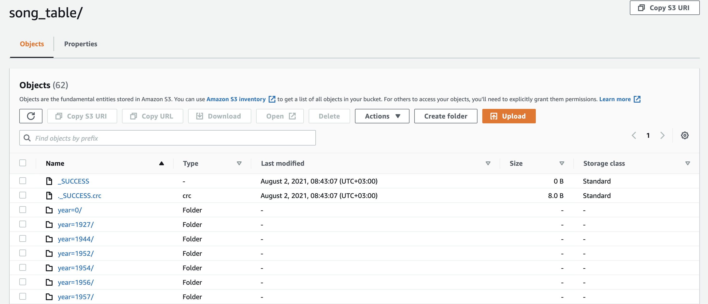
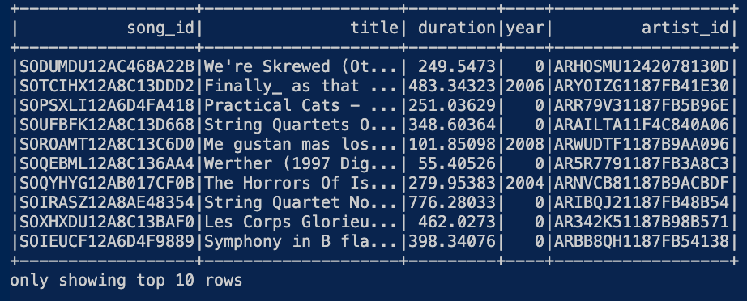
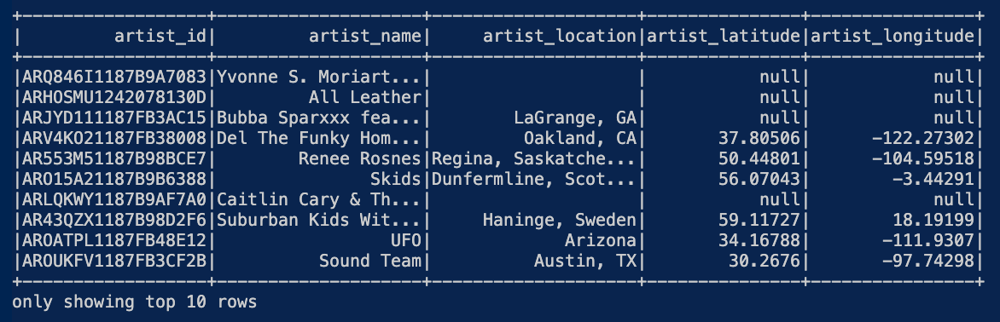
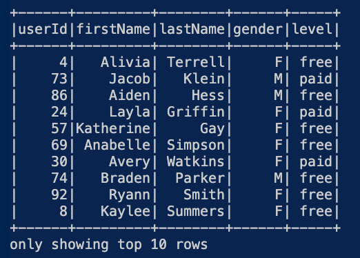
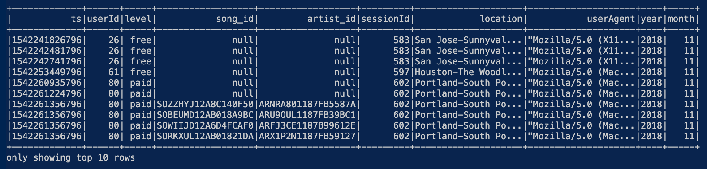
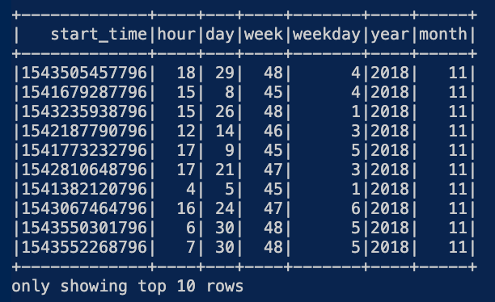

# Project: AWS S3 Data Lake with Spark Processing

This project was completed on 2nd August 2021.

## Introduction

A startup called Sparkify wants to analyze the data they've been collecting on songs and user activity on their new music streaming app. 

All their data is stored in JSON files in AWS S3 buckets. The requirements are:
1. Load the JSON data from S3 into Spark dataframes
2. Transform the data into  5 analytics tables
3. Write the processed data into parquet format
4. Upload the parquet data into S3 to form a data lake
 
This would give Sparkify's analytics team a data lake which they can then query.

A few notes:
The project uses a local Spark instance, so its not leveraging parallel processing.

## Quick Start Guide

1. Ensure Python 3.6+ is installed
2. Clone the repo: ```git clone https://github.com/aivoric/aivoric-Data-Engineering-ND-DataLake-Project-4```
3. Enter the downloaded folder and create a virtual environment: ```python3 -m venv .venv```
4. Activate the virtual environment ```source .venv/bin/activate```
5. Install dependencies: ```pip install -r requirements.txt```
6. Open ```dwh_template.cfg``` and enter your AWS ```key``` and ```secret``` values
7. Rename ```conf.cfg.template``` to ```conf.cfg``` and add your aws + s3 configuration to it
8. Check the main() function in etl.py to comment / uncomments different methods to determine whether you want to run the full or part of the ETL job.
9. Run the etl job with ```python etl.py```

If you run the full ETL job then the following will happen:
1. Raw JSON data is downloaded from the udacity S3, processed, and stored in local parquet format.
2. Data is then processes locally using Spark to create 5 analytical tables and stores the results in local parquet format.
3. The local parquet files are then uploaded back to S3.


## Notes on Files

```etl.py``` is the main entry point into the program. Contains the full ETL job.

```schema.py``` contains the schema for the logs and songs Spark dataframes.

```spark_setup.py``` configures and returns and SparkSession object.


## Database Design

The design includes a single fact table and 4 dimension tables.

3 of the dimension tables (users, songs, artists) are based around logical entities within Sparkify. The time dimension table was created for the purpose of being able to quickly join the table with songplays and query based on different time units.

Here is a summary of all the tables:

#### **Fact Table**

1. **songplays** - records in log data associated with song plays i.e. records with page `NextSong`
    - *songplay_id, start_time, user_id, level, **song_id**, **artist_id**, session_id, location, user_agent*

#### **Dimension Tables**

1. **users** - users in the app
    - *user_id, first_name, last_name, gender, level*
2. **songs** - songs in music database
    - *song_id, title, artist_id, year, duration*
3. **artists** - artists in music database
    - *artist_id, name, location, latitude, longitude*
4. **time** - timestamps of records in **songplays** broken down into specific units
    - *start_time, hour, day, week, month, year, weekday*

## Handling Duplicates

In most cases duplicates handling is done via the .distinct() method in Spark.

For the ```users``` table it's slightly more tricky since we are reading from the EVENTS staging data and we are only interested in the latest events from the user, and hence we would take the users metadata from that. This is solved via an INNER JOIN using the Spark SQL syntax:

```
user_table_insert = ("""
    INSERT INTO users(
        SELECT
            a.user_id
            , a.first_name
            , a.last_name
            , a.gender
            , a.level
        FROM staging_events a
        INNER JOIN (
            SELECT user_id, MAX(ts) as ts
            FROM staging_events
            GROUP BY user_id
        ) b ON a.user_id = b.user_id AND a.ts = b.ts
        )
""")
```

An technical explanation about the above can be found here:
https://stackoverflow.com/questions/121387/fetch-the-row-which-has-the-max-value-for-a-column

## S3 Output Preview








## Preview of the final output data from the dataframes










